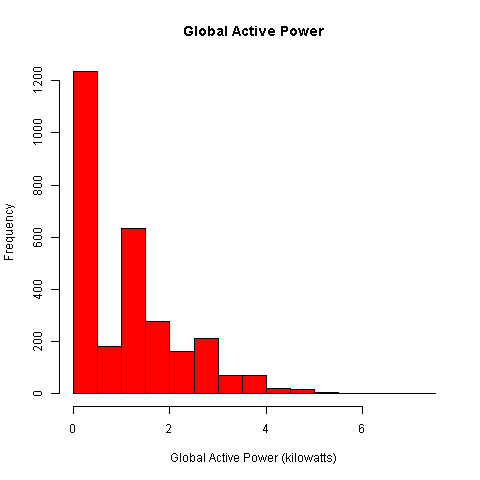
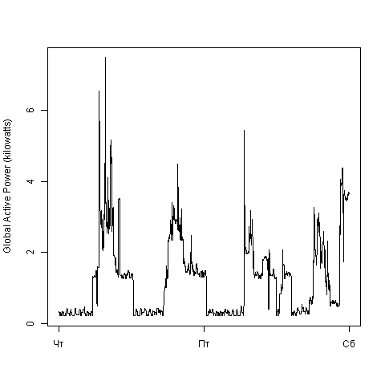
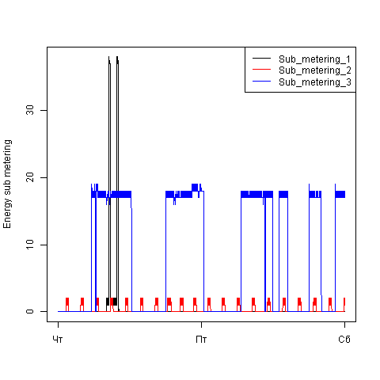
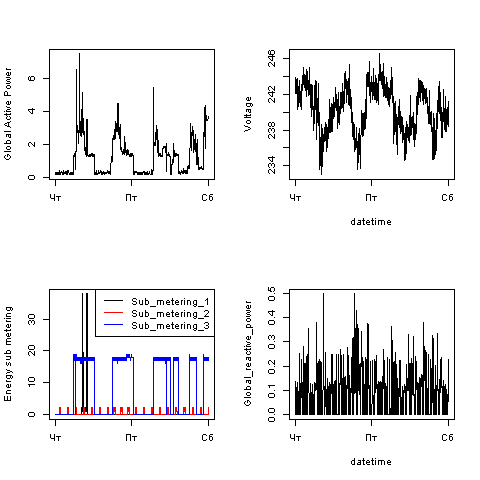

# ExploratoryDataAnalysis1
ExploratoryDataAnalysis CourseProject1

## Introduction

This assignment uses data from
the <a href="http://archive.ics.uci.edu/ml/">UC Irvine Machine
Learning Repository</a>, a popular repository for machine learning
datasets. In particular, we will be using the "Individual household
electric power consumption Data Set" which I have made available on
the course web site:

* <b>Dataset</b>: <a href="https://d396qusza40orc.cloudfront.net/exdata%2Fdata%2Fhousehold_power_consumption.zip">Electric power consumption</a> [20Mb]

* <b>Description</b>: Measurements of electric power consumption in
one household with a one-minute sampling rate over a period of almost
4 years. Different electrical quantities and some sub-metering values
are available.

The descriptions of the 9 variables in the dataset can be taken from
the <a href="https://archive.ics.uci.edu/ml/datasets/Individual+household+electric+power+consumption">UCI
web site</a> or from  <a href="https://github.com/rdpeng/ExData_Plotting1">the task assignment</a> 

## Preliminary action
  Archived dataset should be unpacked into working directory manually.

## Loading the data
  At first all dataset loaded into character format. We wil use only data from the dates 2007-02-01 and 2007-02-02. So this data saved into interim file and then we will work with this interim file (instead the much more bigger original file). 

## Resulting Plots

The four plots constructed according to assignment. 

### Plot 1

 

### Plot 2

 

### Plot 3

 

### Plot 4

 
